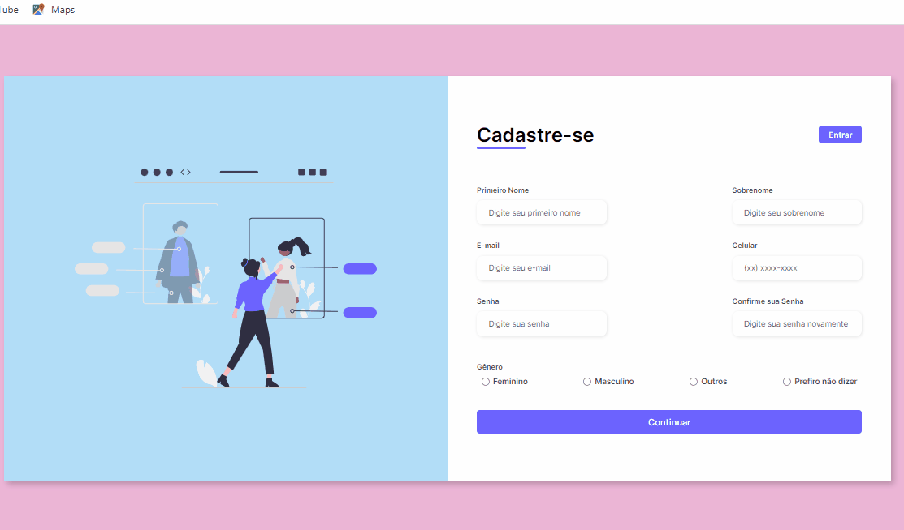

# Projeto Formulário Responsivo ❤👌

## 📝Descrição
treinamento de confecção de formulário responsivo, usando flexbox.

## 🚀 Progresso
- Marcação semântica
- Propriedades personalizadas CSS3
- Flexbox
- Design Responsivo

## 🏸 Design
</img>

Autor

GitHub: <a href="https://github.com/Clau4705">DevClaudinéia</a>

Linkedin: <a href="https://www.linkedin.com/in/claudineia-torres-00456b239/">DevClaudinéia</a>

